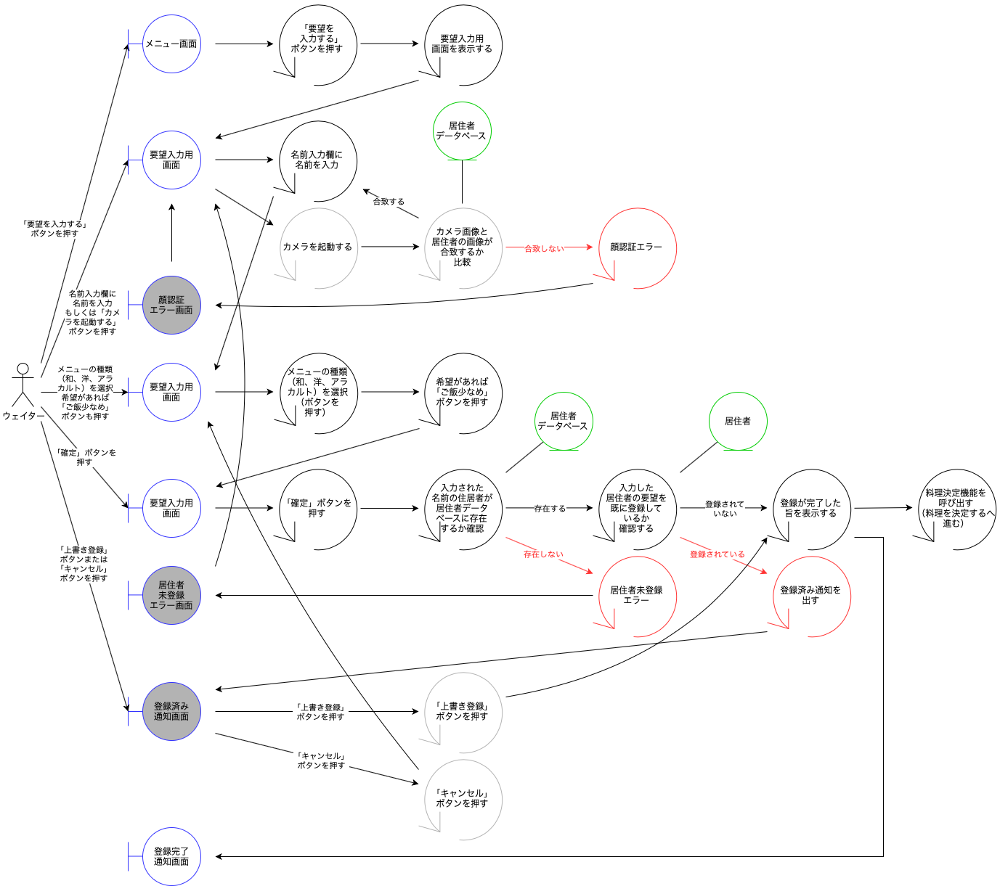

# 伝票くん。　ユースケースモデリング

作成日：2020/07/20  
チーム A:LadyBorden

## 1. ユースケース図

## 1. フロー図

## 2. ユースケース一覧

- [居住者を見分ける](./ユースケース/ユースケース_居住者を見分ける.md)
- [居住者情報を入力する](./ユースケース/ユースケース_居住者情報を入力する.md)
- [料理を決定する](./ユースケース/ユースケース_料理を決定する.md)
- [料理情報を参照する](./ユースケース/ユースケース_料理情報を参照する.md)
- [料理情報を登録する](./ユースケース/ユースケース_料理情報を登録する.md)
- [要望を入力する](./ユースケース/ユースケース_要望を入力する.md)
- [過去の料理を参照する](./ユースケース/ユースケース_過去の料理を参照する.md)

## 3. ドメインモデル図

## 4. シーケンス図

### 4.1 居住者情報を入力する

- メインフロー

### 4.2 料理情報を参照する

- メインフロー

- 代替フロー 2

### 4.3 料理情報を登録する

- メインフロー

- 代替フロー 1

- 代替フロー 2

### 4.4 要望を入力する

- メインフロー

- 代替フロー 1

- 代替フロー 2

- 代替フロー 3

- 代替フロー 4

- 代替フロー 5

### 4.5 過去の料理を参照する

- メインフロー

## 5. ロバストネス図

### 5.1 居住者情報を入力する

### 5.2 料理情報を参照する

### 5.3 料理情報を登録する

### 5.4 要望を入力する

### 5.5 過去の料理を参照する

## 6. システムアーキテクチャ

## 7. クラス図
https://docs.google.com/presentation/d/1j3wQL21SlykMVs-ct3oPGUWNIIika0J7o4yvhLpZWt0/edit#slide=id.g8ea1caff92_0_246 を参照  

## 8. 実装方法

- [実装](./実装/README.md)

## 9.成果物

- 成果物のソースコードは以下から確認することができる  
https://github.com/yuyasawa19/LadyBorden/tree/master/%E4%BC%9D%E7%A5%A8%E3%81%8F%E3%82%93%E3%80%82/%E5%AE%9F%E8%A3%85/denpyoukun/src

### 簡単な背景
詳しい要求は以下を参照  
- [要求仕様書](/伝票くん。/要求仕様書.md)

介護施設におけるレストランでは、居住者からの要望やアレルギーによる料理の変更が多い。  
昼食に関する要望・変更は、その前日または当日の朝に居住者から直接聞き、紙に記入し保存する。  
この動作をWeb上で出来るようにし、必要な料理の情報を確認できるようにする。  

### システム実行方法  
1. プロジェクトのダウンロード  
2. application.propertiesを必要に応じて編集する。以下は初期設定。  
- ポート番号:2289  
- MySQLデータベース設定:localhost:3306/denpyoukun  
- ユーザ名:denpyou パスワード:tokuronI0+
  - ユーザ、データベース、ユーザ権限を事前にMySQLに適用させる必要があります。
3. F5より、Spring Projectの起動。  
4. http://localhost:2289/ よりアクセスできる。  
  
### 実行例
  
http://localhost:2289/ にアクセスすると、以下のようなトップ画面が表示される。  

  
ログイン(未実装)すると、メインメニューが表示される。  

  
「要望を入力する」をクリックすると、以下のフォームから要望を入力することができる。

  
名前の部分は、カメラを利用した顔認証(未実装)により、要望を出した人を自動入力することができる。  
適切な入力を行い、データを送信すると、送信完了画面が表示される。  
既存データとして、ログイン時に以下の情報を設定している。追加にはDBに直接入力する。  
- 居住者：マンダ・澤・中村
- 料理：2020/9/1の和食・洋食　2020/9/2の和食・洋食・アラカルト

  
なお、エラーチェックがあり、DBに存在しない居住者や料理を入力した際、エラーが表示される。

  
メインメニューから「料理を参照する」をクリックすると、居住者の一覧が表示される。

  
居住者を選択すると、その人の要望情報から、作るべき料理の一覧が表示される。

### 実装しきれていない仕様
- ユーザの新規作成、削除機能
- 料理情報の新規作成
- アレルギー等を加味した料理の変更機能
