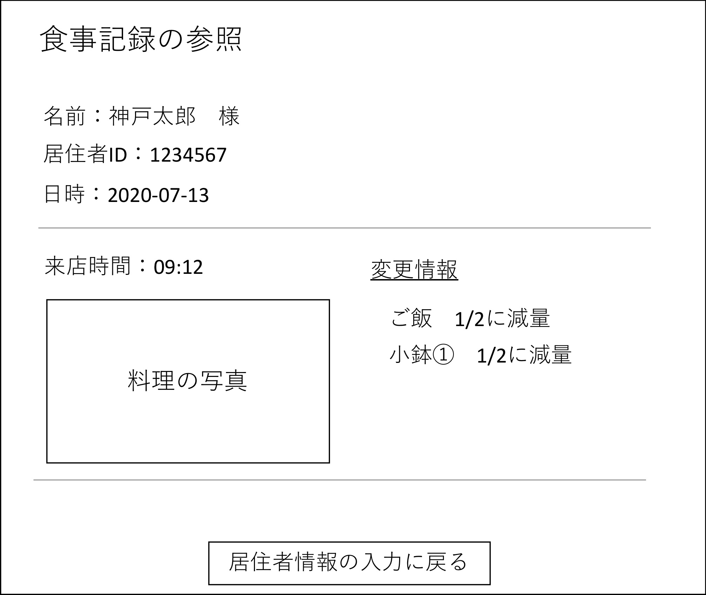
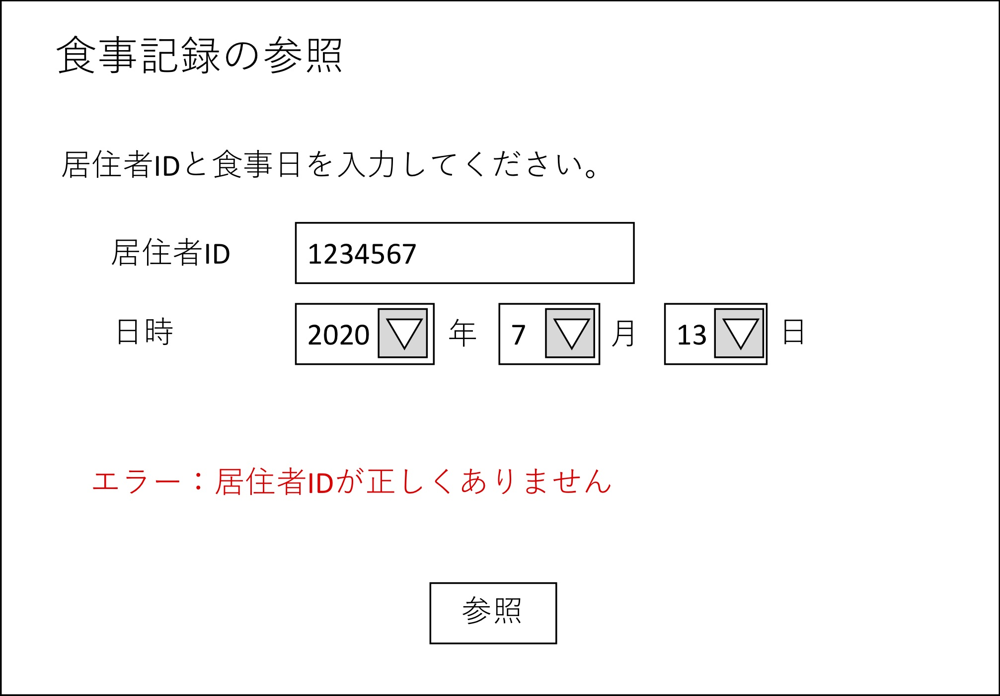
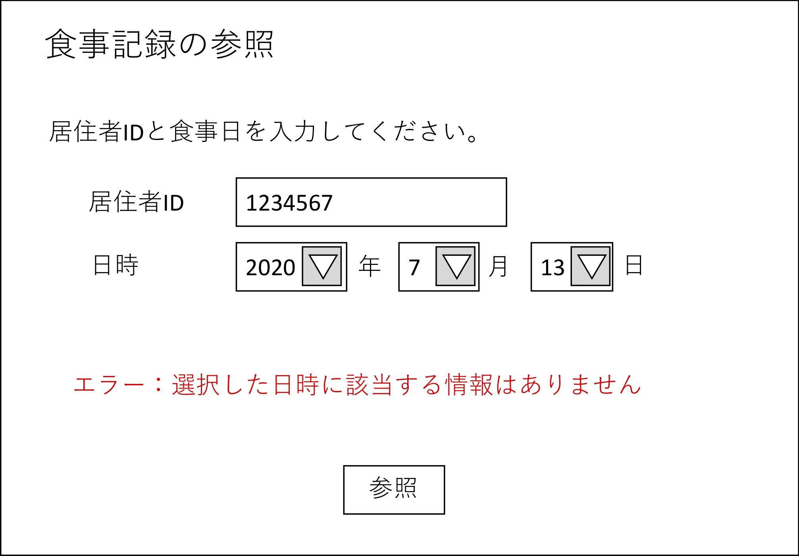

# ユースケース:過去の料理を参照する

## 概要
- 概要：ウエイターと管理者が、居住者が過去の食事記録を参照する。
- アクター：ウエイター/管理者
- 事前条件：ユーザがシステムにログインしている。
- 事後条件：ユーザが食事記録を確認できる。
- トリガ―：ウエイター/管理者が、「過去の食事記録」ボタンを押す。

## 基本フロー
1. ユーザ（ここでは、ウエイター又は管理者）が、メニューから「過去の食事記録」ボタンを押す。 
2. システムは、ユーザに「過去の食事記録参照」画面を表示する。  
3. ユーザが、参照したい居住者の名前と、食事した日付を入力し、参照ボタンを押す。  
4. システムは、居住者データベースから、該当する居住者データ、およびその食事情報を取得する。  
5. システムは、当該居住者のその日の食事記録があれば表示する。  

## 代替フロー1
3a-1. 存在しない居住者の名前が入力された場合、入力エラーを表示し、2へ戻る。  
3a-2. 不当な日時(その居住者が入居する前の日時、未来の日時、食事をしていない日時）が入力された場合、入力エラーを表示し、3へ戻る。  

## GUI紙芝居
情報入力画面  
  
食事記録の表示画面  
  
居住者IDの入力エラー画面  
  
日時の入力エラー画面  

