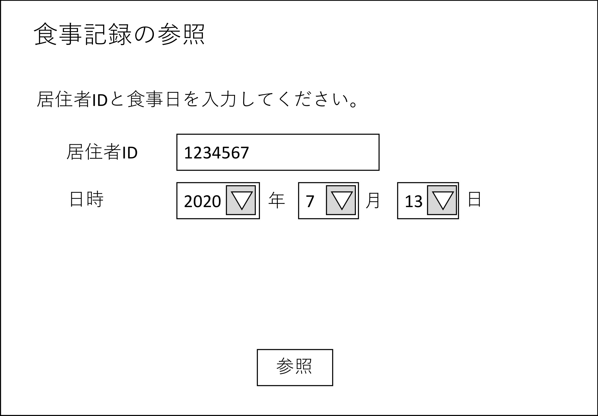
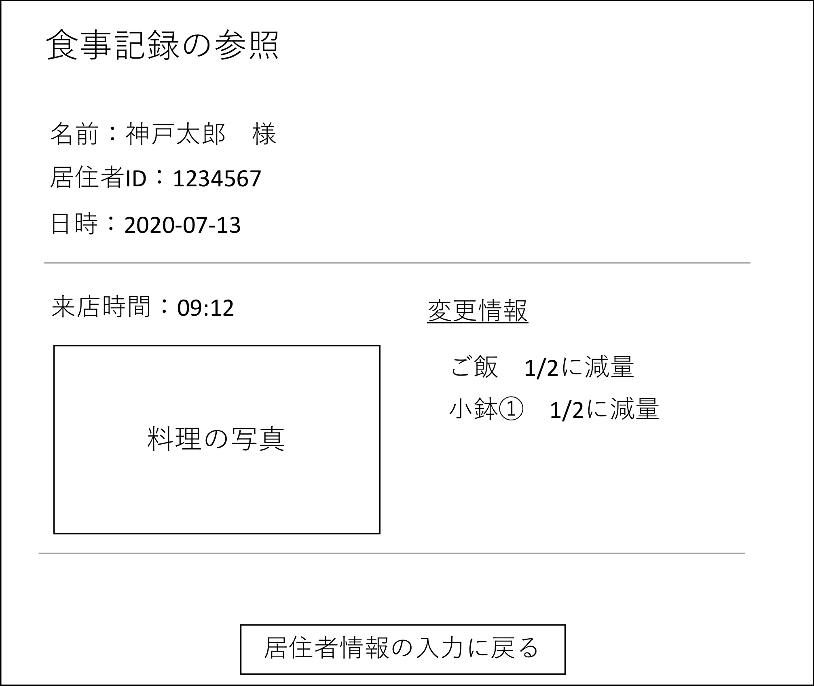
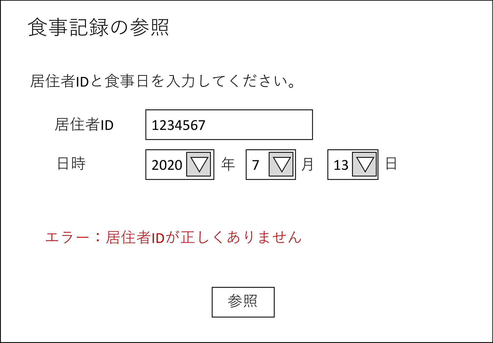
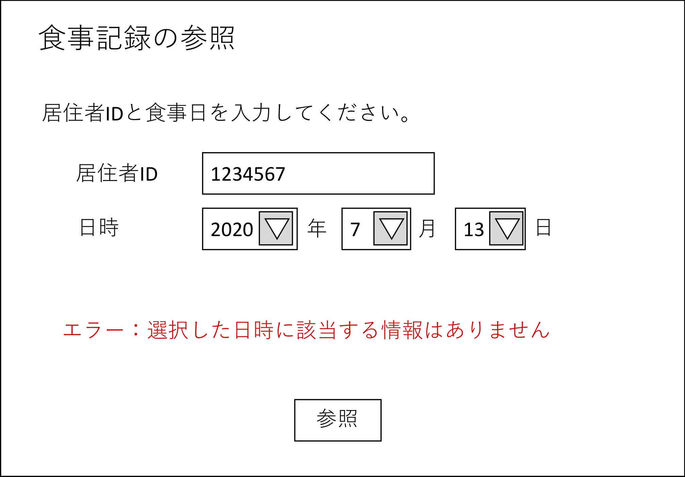

# ユースケース:過去の料理を参照する

## 概要
- 概要：ウエイターと管理者が、居住者が過去の食事記録を参照する。
- アクター：ウエイター/管理者
- 事前条件：ユーザがシステムにログインしている。
- 事後条件：ユーザが食事記録を確認できる。
- トリガ―：ウエイター/管理者が、「過去の食事記録」を選択する。

## 基本フロー
1. ユーザが、メニューから「過去の食事記録」のボタンを押す。  
2. ユーザが、居住者を識別できるIDを入力する。  
3. ユーザが、食事した日時を選択する。  
4. ユーザが、「参照」ボタンを押す。  
5. システムは、入力された情報で居住者の食事記録を検索する。  
6. システムは、当該居住者のその日の食事記録があれば表示する。  

## 代替フロー1
5a-1. 存在しない居住者のIDが入力された場合、入力エラーを表示し、2へ戻る。  
5a-2. 不当な日時(その居住者が入居する前の日時、未来の日時）が入力された場合、入力エラーを表示し、3へ戻る。  

## 代替フロー2
6a-1. その日に食事をした記録が登録されていない場合、記録がない旨のエラーを表示する。

## GUI紙芝居
情報入力画面  
  
食事記録の表示画面  
  
居住者IDの入力エラー画面  
  
日時の入力エラー画面  
